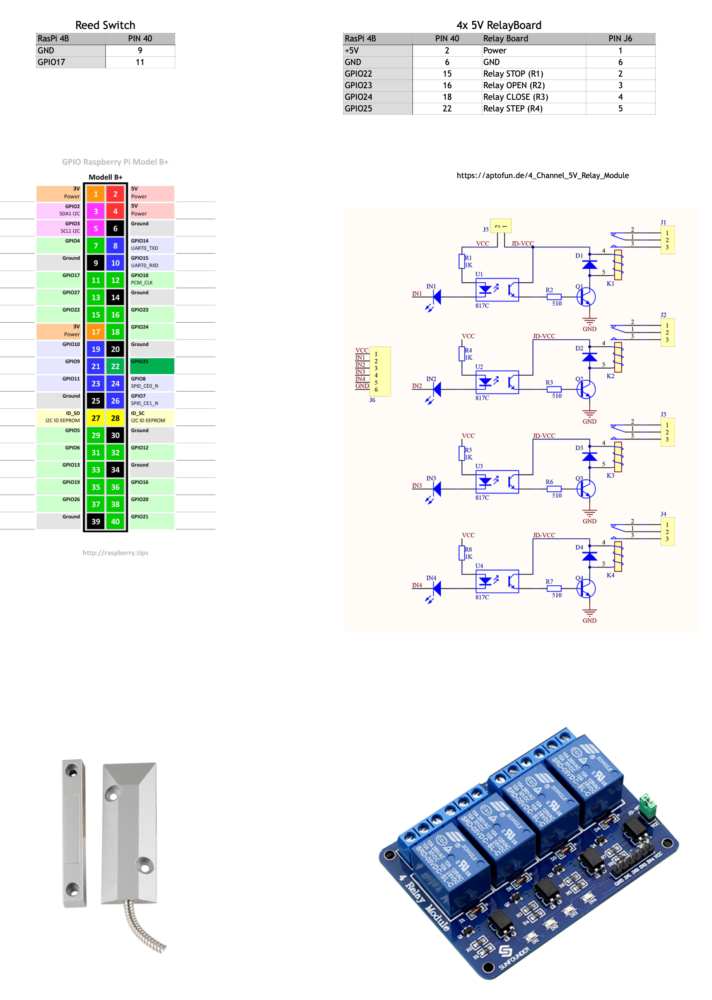

## Original contribution

This project is inherited from popular [GarageQTPi project](https://github.com/Jerrkawz/GarageQTPi.git)

## Preface
Majordomo is suggested as a controller of typical outside garden door with control unit, which offers open contacts for external controller performing opening, stopping and closing gate. Some units offer even step mode, which opens gate for half.

Majordomo uses 4 hardware relays and independent reed switch, which indicates the status of gate is closed. You should have to instal independent reed switch, do no use built-in one in gate control unit. Yould could lost the warranty.

For future functionality, software reserves independent BUTTON input for Door Bell, but this feature is not currently implemented.

Actually, software solution uses only two relays - **STEP RELAY** and **STOP RELAY**. 
Check your documentation, how to control your controller with only two commands. 
1. **STEP** should act as inverter. When gate is opened, should start closing, when closed, shoud start opening. Most of gate controllers have an external switch for manual gate controll - in this case connect relay parallel to this switch (NO).
2. **STOP** should immediately stops any action. Usualy acts as reverse contact (NC).

## Hardware

1. Raspberry pi 4
   * [Raspberry Pi 4B](https://www.amazon.de/dp/B07TC2BK1X/ref=cm_sw_em_r_mt_dp_35PGYZTZP17XYZ7DT9EN)
2. 4-Channel 5V Relay board with optocouplers 
   * [Relay board](https://www.amazon.de/dp/B07CRRK7R8/ref=cm_sw_em_r_mt_dp_FN9T62C92G276815FRJ)
3. Magnetic Reed switch
   * [Magnetic Switch](https://www.amazon.com/dp/B07F5WS5WX/ref=cm_sw_em_r_mt_dp_X87FGHWG5QX7VVAK05BK)
4. Additional wires/wire nuts. 
    * solid copper wire for garage motor wiring
    * jumper wiries for GPIO pins
5. Mounting Hardware. 
    * For external environment, for best result use at least IP44 box.


## Wiring/Installation



Reed switch should be wired directly beteween GPIO17 and GND.
Optional button for door bell beteween GPIO27 and GND.

### Relay wiring
**IMPORTANT: You should always consult with a user guide of control unit of gate before wiring relays**

Relays have two type of contacts - Normally Opened (NO) and Normaly Closed (NC). Be sure to wire correct type of output. 
Relays of type OPEN, CLOSE and STEP should by typically NO, **STOP** would be typicaly NC.

## Software

### Prerequisities 
* Raspberry Pi 3 or 4 running Rasbian Jessie or later
* Python 3.7.x
* pip3 (python 3 pip)
* Homeassistant with MQTT server

### Installation
1. `git clone https://github.com/Jerrkawz/GarageQTPi.git` to `/home/pi/Development/majordomo` folder
2. `pip3 install -r requirements.txt`
3. edit the `config.yaml` to set up mqtt (See below)
3. run `nohup python3 /home/pi/Development/majordomo/mqtt_gate/main.py &` 
5. Optionaly, add start script: copy and enable `majordomo.service` for `systemd ` daemon via `Systemctl` command.

## MQTT setup
I won't try to butcher an mqtt setup guide but will instead link you to some other resources:

HomeAssistant MQTT Setup: https://home-assistant.io/components/mqtt/

Bruh Automation: https://www.youtube.com/watch?v=AsDHEDbyLfg

## Homeassistant component setup
Either follow the cover setup or enable mqtt discovery  
HomeAssistant MQTT Cover: https://home-assistant.io/components/cover.mqtt/  
HomeAssistant MQTT Discovery: https://home-assistant.io/docs/mqtt/discovery/

## API Reference

The server works with the Home Assisant MQTT Cover component out of the box but if you want to write your own MQTT client you need to adhere to the following API:

Publish one of the following UPPER CASE strings to the command_topic in your config:

`OPEN | CLOSE | STOP`

Subscribe to the state_topic in your config and you will recieve one of these lower case strings when the state pin changes:

`open | closed`

Thats it!

## Sample Configuration

config.yaml:
```
cover:
  - platform: mqtt
    name: "Gate"
    device_class: "gate"
    command_topic: "homeassistant/gate/set"
    state_topic: "homeassistant/gate/state"
#   position_topic: "homeassistant/gate/state"
    availability:
      - topic: "homeassistant/gate/availability"
    qos: 0
    retain: true
    payload_open: "OPEN"
    payload_close: "CLOSE"
    payload_stop: "STOP"
    state_open: "open"
    state_opening: "opening"
    state_closed: "closed"
    state_closing: "closing"
    payload_available: "online"
    payload_not_available: "offline"
    optimistic: false
    value_template: '{{ value }}'
    tilt_status_topic: 'homeassistant/gate/tilt-state'
    tilt_status_template: '{{ value_json["PWM"]["PWM1"] }}'
    tilt_min: 0
    tilt_max: 180
    tilt_closed_value: 70
    tilt_opened_value: 180
  - platform: template
    covers:
      door:
        device_class: door
        friendly_name: "Main Door"
        value_template: >-
          
            open
          
            closed
          
        open_cover:
          service: switch.turn_on
          data:
            entity_id: switch.door_controller
        close_cover:
          service: switch.turn_off
          data:
            entity_id: switch.door_controller
        icon_template: >-
          
            mdi:door-open
          
            mdi:door
          
```
        
## Questions

For additional questions, you can contact me on `developer@ic-servis.com`.
Libor Kučera, October 2021